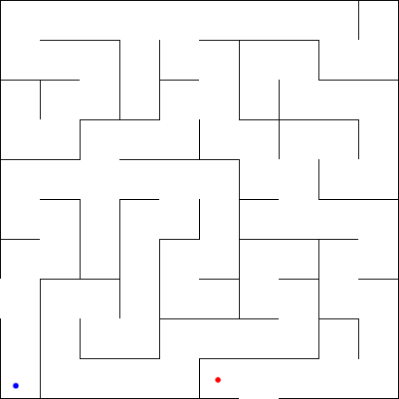
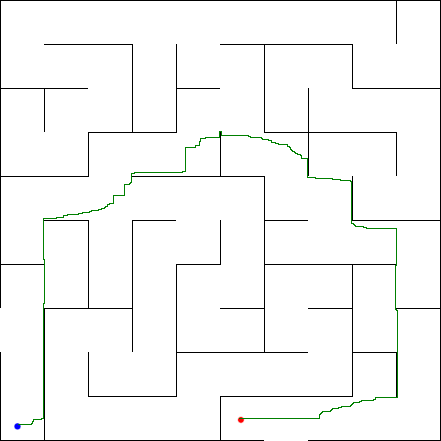
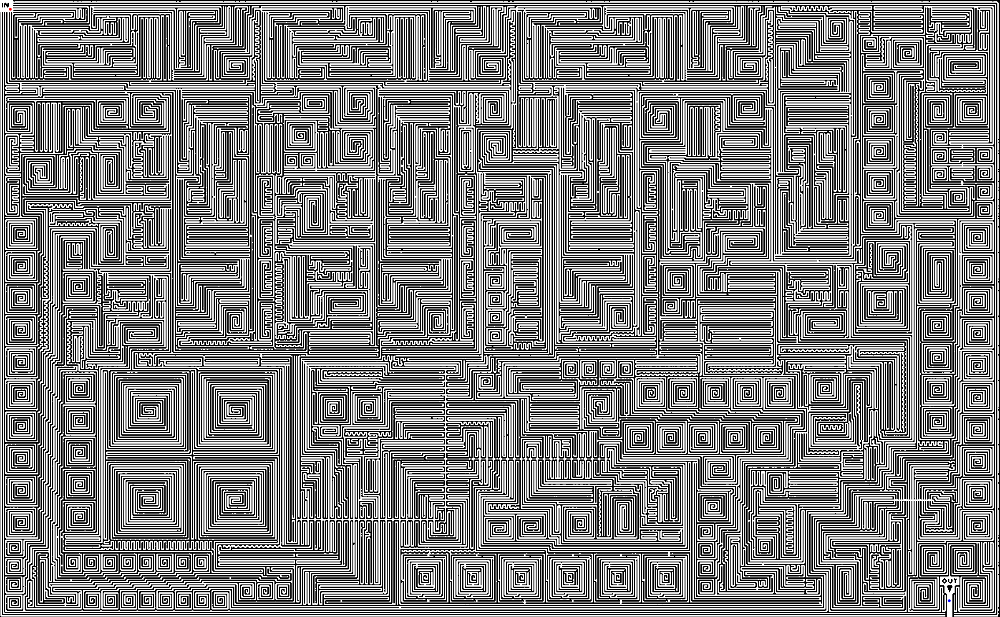
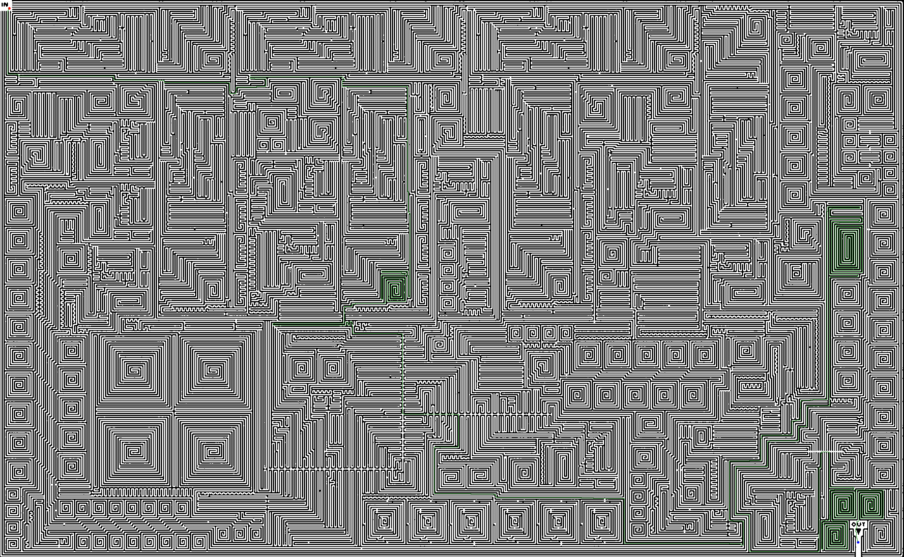
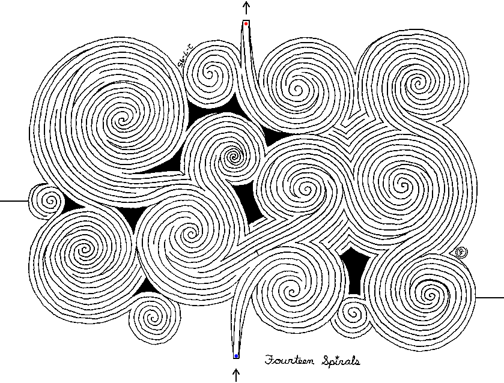
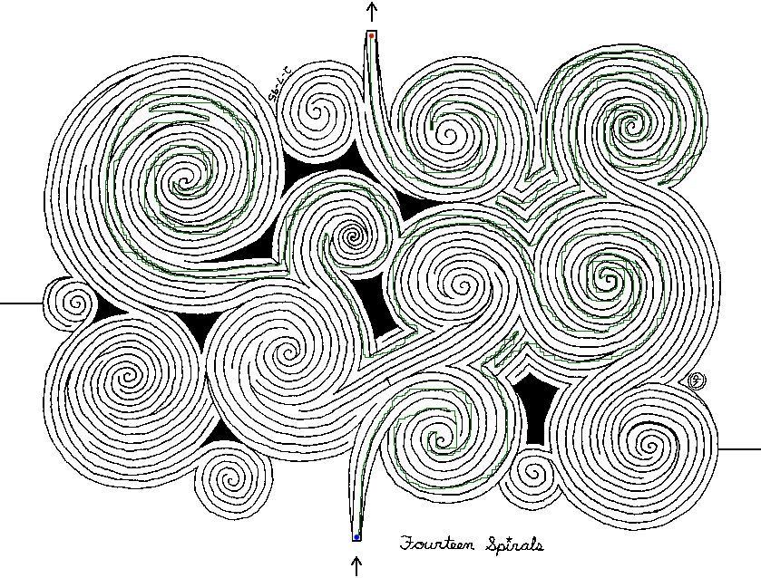

#So, you want a C# program to solve a maze for you?

###Invariants:
* The maze starts at black and finishes at blue.
* Maze walls are black.
* Solution is drawn in green.
 
###Example "Maze 1":

###Solution:

[Source](http://www.doolhoven.com/gemakkelijke-doolhof-01.htm)

###Example "Maze 2":

###Solution:

[Source](http://www.astrolog.org/labyrnth/art.htm)

###Example "Maze 3":

###Solution:

[Source](http://gwydir.demon.co.uk/jo/maze/other/index.htm)

